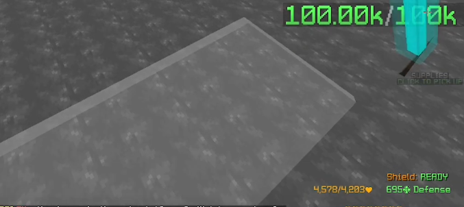

# beuld addon's
### [ChatTriger](https://www.chattriggers.com/) module for [hypixel](hypixel.net) - [skybock](wiki.hypixel.net)

this module add some QOL feature based on my activitie in this game like:
 - kuudra
 - dungeon
 - some other tings

## features:
<h4>

Etherwarp sound

customizable Etherwarp sound

social

make join/leave guild/friend message clickable to add /pv.
 

pc area

not very usefully except some case on slash

pearl waypoint

pearl lineup waypoint depend on your position. example if your at tri the module stop rendering square waypoint
some waypoint can be added in one of those files: [PearlWaypoint](./feature/kuudra/sup/PearlLineup/PearlWaypoint.json), [SuppWaypoint](./feature/kuudra/sup/PearlLineup/SuppWaypoint.json) 

beacon at ballista piles (p1)

todo : insert screen

beacon at ballista piles (p2)

todo : insert screen

display closest piles percentage

/title closest pile percentage

rend info

display rend pull in chat

format mana drain

 todo: insert screen

</h4>

### Auto restart

 - Auto restart: 
   - auto start kuudra or dg at the end of a run (can config downtime)
   - `!dt` party chat command automatically stop auto mode

## Commands:
- `/beuld` - open the main config menu
- `/beuldautors [<dg/kuudra> <on/off>](optional)` - open auto restart config or toggle auto rs
- `/fo` - show all online friend(s)
- alias: 
  - `/t5` -> `/join_instance KUUDRA_INFERNAL`
  - `/t4` -> `/join_instance KUUDRA_FIERY` 
  - `/t3` -> `/join_instance KUUDRA_BURNING` 
  - `/t2` -> `/join_instance KUUDRA_HOT` 
  - `/t1` -> `/join_instance KUUDRA_NORMAL` 

## Dependencies:
- [ChatTriger]()
- Bloomcore
- [Vigilance](https://www.chattriggers.com/modules/v/Vigilance)
- [RenderLib](https://www.chattriggers.com/modules/v/RenderLib)
- [BeaconBeam](https://www.chattriggers.com/modules/v/BeaconBeam)

## Credit:
### many features of this module are inspired by other module or mod like
 - odin, chearys (don't cheat, it's bad)
 - nwjn or volcaddons
#### in the case a part of code does is not my own it will be notified in the code